# Banking Dashboard

## Problem Statement
Develop a basic understanding of risk analytics in banking and financial services and understand how data is used to minimise the risk of losing money while lending to customers.

## Solution
With our dashboards, created using the latest Power BI tools, the company can make decisions based on the applicant's profile—such as whether the applicant is likely to repay the loan—helping to approve or reject loans more effectively.

## About Dataset
This dataset contains information about bank details and various client details, consisting of multiple tables interlinked through keys like primary key and foreign key. The various tables are:
- Banking Relationship
- Client-Banking
- Gender
- Investment Advisor
- Period

## Data Cleaning
- **Engagement Timeframe:** Created a new column in the Client-Banking table to indicate the timeline of clients in banks.
- **Engagement Days:** Added a column in the Client-Banking table to show how many days the client has spent since joining the bank.
- **Income Band:** Created bins for the Estimated Income column: `< 100,000` as 'Low', `< 300,000` as 'Mid', and added a new column named `Income Band` in the Client-Banking table.
- **Processing Fees:** Added a new column named `Processing Fees` based on the `Fee Structure` column (e.g., if fee structure is high, then processing fee is 0.05).

## Calculated Functions

### SUM
Adds all the numbers in a column.
- **Syntax:**
  ```
  SUM(<column>)
  ```
- **Example:**
  ```
  Bank Deposit = SUM('Clients - Banking'[Bank Deposits])
  ```

### DISTINCTCOUNT
Counts the number of distinct values in a column.
- **Syntax:**
  ```
  DISTINCTCOUNT(<column>)
  ```
- **Example:**
  ```
  Total Clients = DISTINCTCOUNT('Clients - Banking'[Client ID])
  ```

### SUMX
Returns the sum of an expression evaluated for each row in a table.
- **Syntax:**
  ```
  SUMX(<table>, <expression>)
  ```
- **Example:**
  ```
  Total Fees = SUMX('Clients - Banking', [Total Loan] * 'Clients - Banking'[Processing Fees])
  ```

### SWITCH
Evaluates an expression against a list of values and returns one of multiple possible result expressions.
- **Syntax:**
  ```
  SWITCH(<expression>, <value>, <result>[, <value>, <result>]…[, <else>])
  ```

### DATEDIFF
Returns the number of interval boundaries between two dates.
- **Syntax:**
  ```
  DATEDIFF(<Date1>, <Date2>, <Interval>)
  ```
- **Example:**
  ```
  Engagement Days = DATEDIFF('Clients - Banking'[Joined Bank], TODAY(), DAY)
  ```

## KPIs

- **Total Clients:**
  - Represents the total number of clients in banking.
  - `Total Clients = DISTINCTCOUNT('Clients - Banking'[Client ID])`

- **Total Loan:**
  - Gives information about the sum of bank loan, business lending, and credit card balance for a particular investor or gender.
  - `Total Loan = [Bank Loan] + [Business Lending] + [Credit Cards Balance]`

- **Bank Loan:**
  - The loan amount to be repaid by the client to the bank.
  - `Bank Loan = SUM('Clients - Banking'[Bank Loans])`

- **Business Lending:**
  - The loan amount given to small businesses.
  - `Business Lending = SUM('Clients - Banking'[Business Lending])`

- **Total Deposit:**
  - The amount deposited by particular investors in the bank.
  - `Total Deposit = [Bank Deposit] + [Savings Account] + [Foreign Currency Account] + [Checking Accounts]`

- **Total Fees:**
  - The amount charged by the bank for account set-up, maintenance charges, etc.
  - `Total Fees = SUMX('Clients - Banking', [Total Loan] * 'Clients - Banking'[Processing Fees])`

- **Bank Deposit:**
  - The money put in the bank.
  - `Bank Deposit = SUM('Clients - Banking'[Bank Deposits])`

- **Checking Account Amount:**
  - Offers easy access to money for daily transactional needs.
  - `Checking Accounts = SUM('Clients - Banking'[Checking Accounts])`

- **Total CC Amount:**
  - A short-term source of financing for a company by a bank.
  - `Total CC Amount = SUM('Clients - Banking'[Amount of Credit Cards])`

- **Saving Account Amount:**
  - An interest-bearing deposit account held at a bank.
  - `Savings Account = SUM('Clients - Banking'[Saving Accounts])`

- **Foreign Currency Amount:**
  - An account held in a currency that is not the currency of India, Bhutan, or Nepal.
  - `Foreign Currency Account = SUM('Clients - Banking'[Foreign Currency Account])`

- **Engagement Account:**
  - Puts the customer at the center and aims to deliver the digital experiences they expect.
  - `Engagement Length = SUM('Clients - Banking'[Engagement Days])`

- **Credit Cards Balance:**
  - The total amount of money currently owed by a cardholder to their credit card bank.
  - `Credit Cards Balance = SUM('Clients - Banking'[Credit Card Balance])`

## Visualization and Results

### Home
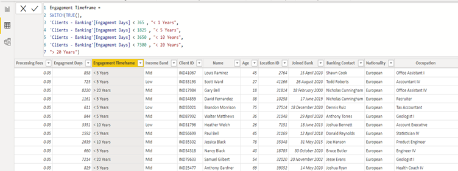

### Loan Analysis
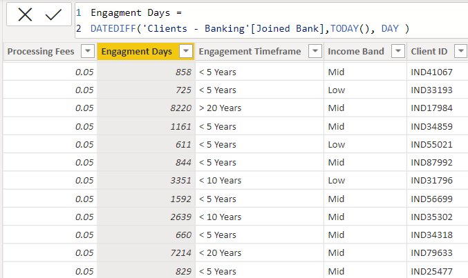
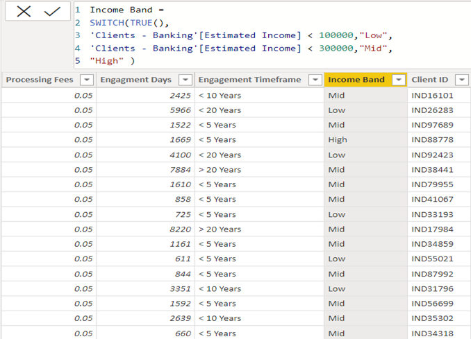

### Deposit Analysis
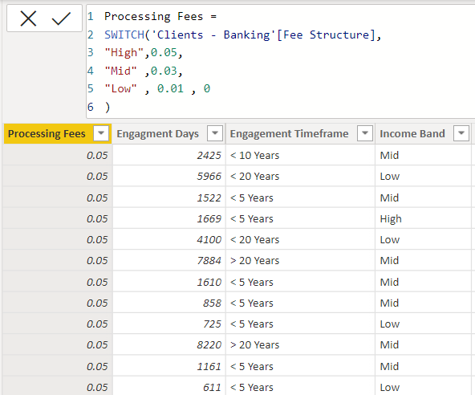
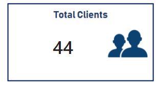

### Summary Dashboard
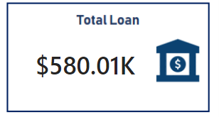
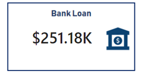
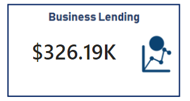
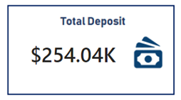
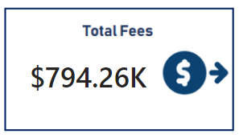
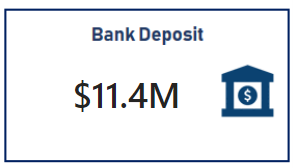
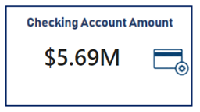
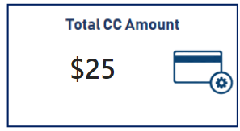
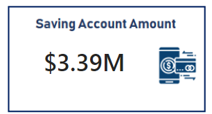
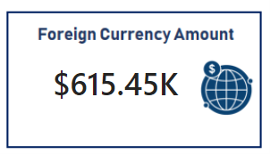
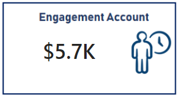
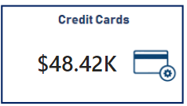
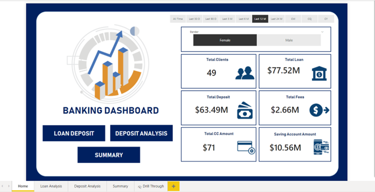
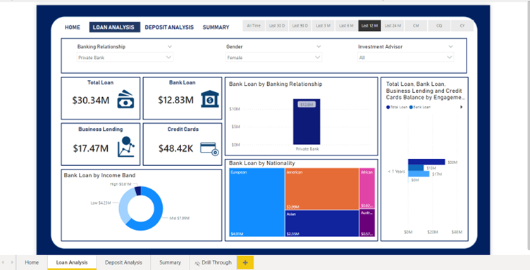
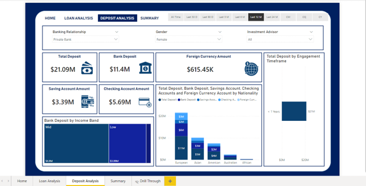
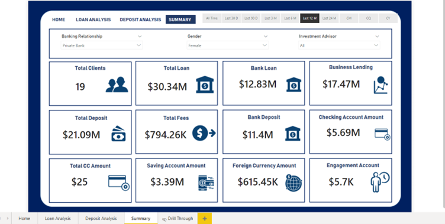

## Conclusion
Empowered by the latest data visualization techniques, Power BI dashboards are among the most effective resources for use in the banking sector. As outlined in this write-up, a banking operations dashboard in Power BI can be developed with key banking-related metrics and KPIs.

## Future Work
- With these dashboards, banks can easily know the total loan amount and all other details of a particular investor.
- It helps identify which types of banks have more clients (e.g., private banks), enabling others to build strategies to increase their client base.
- Provides insights about which nationality has the highest bank loans.
- Gives information about various types of amounts involved in different types of accounts by investors. 